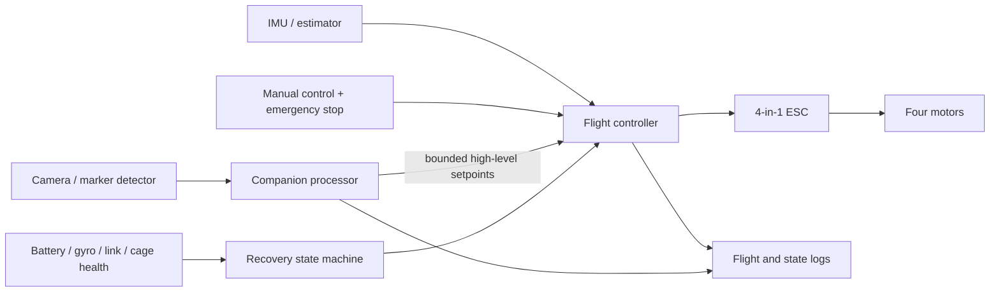
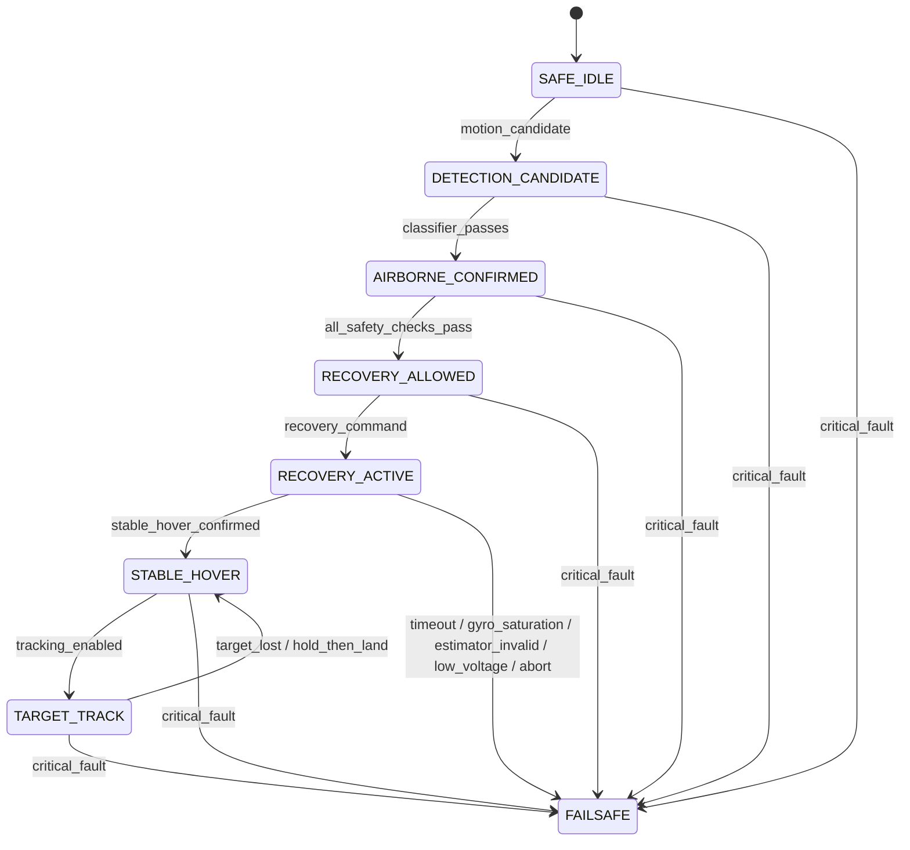

# Historical control architecture and recovery state machine

Historical specification for the earlier aircraft. The current study follows the
[roadmap](../ROADMAP.md); these old tasks and thresholds do not transfer to it.

The machine-readable [state specification](state_machine.json) remains because
the frozen historical drop protocol references its failsafe path. No current
controller implementation or flight authorization follows from these states.
The unused Mermaid renderer has been removed; the specification and tests remain.

## Architecture

The companion processor never commands individual motors. Manual override and critical flight-controller failsafes take priority.

## Recovery State Machine

Every transition must log its trigger, evaluated guards, timeout, command, and reason.

## Estimator Envelope

- Initial angular rate must remain below 80% of the verified gyro measurement limit.
- Configured firmware gyro range must be verified against the IMU datasheet.
- Recovery is rejected on gyro saturation or invalid estimator health.
- External video or motion capture must validate onboard attitude estimates during controlled tests.
- No recovery claim is valid outside the tested estimator envelope.
