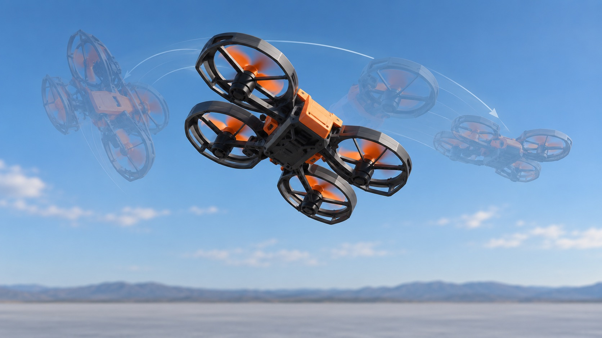
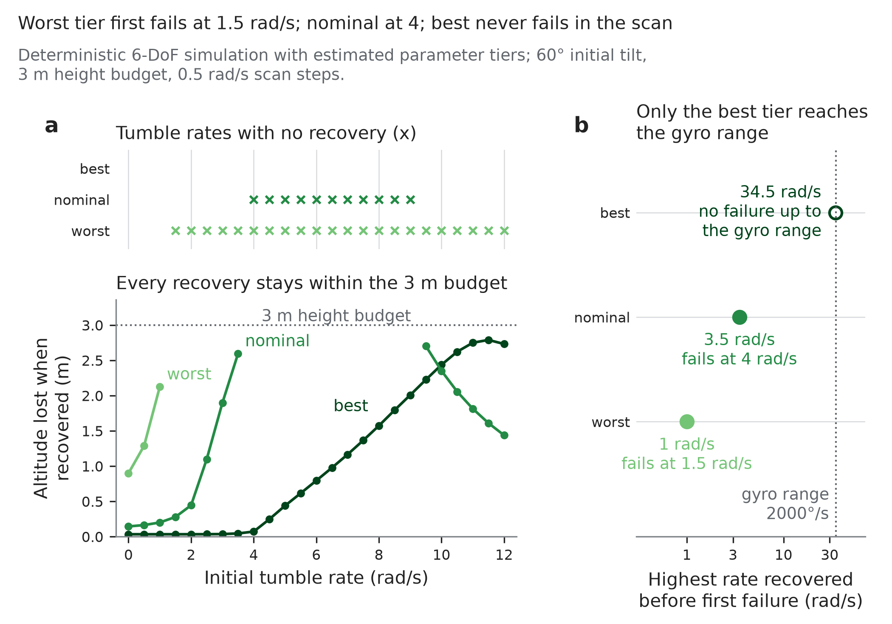

# Multirotor Recovery Dynamics

Can a small drone that is thrown, dropped or loses a motor get itself level
again before it hits the ground? This repository models that recovery in
simulation, and is now moving to bench and flight measurements on a stock
Veeniix V995 micro-quad.

[](https://github.com/500ft/multirotor-recovery-dynamics/actions/workflows/ci.yml)

[](LICENSE)

[Results](#simulation-results) · [Roadmap](ROADMAP.md) ·
[Quick start](#quick-start) · [Safety](#safety-and-limits)



*Concept illustration (AI-generated), not a flight test.*

## About

Recovery depends on several things at once: how fast the drone detects the
fall, how much torque the motors can produce, the battery's state, where the
mass sits, and what any guard adds. A controller that looks good in one
nominal case can still fail across realistic variation, so the model runs
Monte Carlo sweeps over those variations and judges each case against a
survivable-landing criterion.

The simulation work used a designed 130–165 g vehicle with estimated and catalog
inputs. In September the physical platform became a stock V995 (about 50 g,
stock board and transmitter), and the bench and CAD work now target that
aircraft. Values are never copied between the two: the V995 has its own
parameter register and its own gates.

## Simulation results

All of these use estimated inputs. None has been checked against hardware.

| Question | Result |
| --- | --- |
| Does the vehicle recover with the placeholder torque estimate? | 4% of trials at a 2 rad/s tumble, once part tolerances are included |
| With a four-motor mixer model and a revised controller? | 300 of 300 in the reported sweep (a prediction, not a test) |
| Does a guard around the airframe help recovery? | No. In paired trials the guarded design lost 69 of the 76 cases where the two designs differed; it adds mass and rim inertia it doesn't earn back |
| Does a parachute help at these heights? | No. With inflation time modelled it saves 0 of 2,000 in every case; it needs about 10.5 m of drop, and the tallest case is 6 m |
| One rotor out? | Marginal at 2 rad/s tumble, unrecoverable at 6 rad/s |
| Two adjacent rotors out? | Nothing survives in any tested case |

One caveat applies to every rotor-out number. The simulator cuts all four
motors until the failure is detected, which is closer to a release than to a
motor failing in flight. A first diagnostic of the in-flight case showed the
effect of keeping the healthy motors running changes sign from case to case.
The details are in [current results](Analysis/current-results.md).



*Simulated altitude lost against initial tumble rate, by component tier, with
estimated inputs. [Figure provenance](docs/data-and-figures.md).*

## Hardware so far

- **Bench chain.** A QT Py RP2040 reads a load cell through an NAU7802
  amplifier, plus an INA260 power monitor and an LIS3DH accelerometer. Firmware
  and host capture code are written and tested on synthetic serial output. They
  have not run on hardware yet. [Wiring and bring-up](docs/bench-acquisition.md).
- **CAD.** The load-cell end adapter is generated and checked. The cradle that
  holds the whole V995 on the load cell, and the base plate under it, have
  working generators that are waiting on five measurements of the aircraft and
  the bench. [V995 fixture](cad/v995/README.md).

## Quick start

Python 3.11, the CI version. No hardware or CAD install is needed.

```sh
git clone https://github.com/500ft/multirotor-recovery-dynamics.git
cd multirotor-recovery-dynamics
python -m venv .venv
source .venv/bin/activate
python -m pip install -r requirements.txt
python cad/input_requests.py --check
python -m unittest Analysis.tests.test_bench_inputs Analysis.tests.test_results_numbers -v
```

Both test modules should report `OK`, and pending inputs stay pending. The
[reading guide](docs/START_HERE.md) covers the full analysis suite, study
regeneration and the pinned CadQuery environment.

## What's next

Weigh the V995 and take five measurements, then build the cradle and measure
thrust and power against throttle. After that comes an airborne logger board to
record what the stock controller does when the drone is released. The
[roadmap](ROADMAP.md) has the steps; its finish line is a proposal waiting for
the owner to confirm.

## Safety and limits

**Do not attempt recovery flights from the current state of this repository.**
Work through the [bench checklist](Instrumentation/propulsion-bench-safety-checklist.md)
and [operating constraints](Safety/README.md) first.

- Mass properties, propulsion, guard response and recovery have not been
  measured. A passing test or a good simulated sweep does not change that.
- The stock V995 board has no known command or telemetry interface, so a
  custom recovery controller can't run on it.

## Documentation

| Document | What it covers |
| --- | --- |
| [Reading guide](docs/START_HERE.md) | Short review or full reproduction |
| [Current results](Analysis/current-results.md) | Mass, guard, recovery and Monte Carlo results in full |
| [Survivable-set design](docs/specs/survivable-set/design.md) | The paired study behind the guard and parachute results |
| [Literature review](literature/README.md) | What is established, what is open, and which claims the sources contradict |
| [Engineering audit](docs/ENGINEERING_AUDIT.md) · [traceability](docs/TRACEABILITY.md) | Which numbers are derived and which are assumed |
| [Data and figures](docs/data-and-figures.md) | Inputs and code for each plot |
| [Open questions](OPEN_QUESTIONS.md) | Decisions still needed |
| [State machine](Controls/state_machine.json) | Controller states and transitions |

```text
Analysis/          models, gates, tests and result write-ups
Controls/          state machine and interfaces
Engineering Data/  parameter budgets, requirements and failure analysis
cad/               geometry generators, input registers and checks
Instrumentation/   bench firmware, capture code and safety checklist
Safety/            release-rig planning and operating limits
Figures/           simulation figures and diagrams
docs/              specifications and guides
```

## Contributing and license

Read [CONTRIBUTING.md](CONTRIBUTING.md) before changing an input, controller or
result. Report problems in
[issues](https://github.com/500ft/multirotor-recovery-dynamics/issues/new/choose)
with the command, revision and what you saw.

Code is [MIT licensed](LICENSE); third-party sources keep their own terms. Cite
the repository revision and the model or result used. The project was first
called SelfStabilizingDrone ([identity note](docs/REPOSITORY_IDENTITY.md)).
