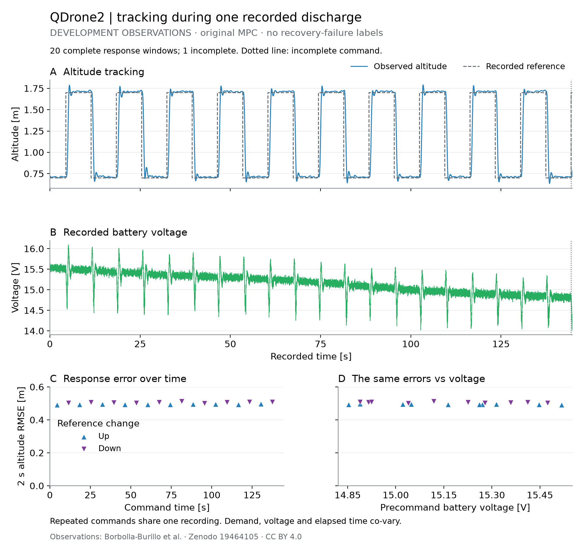

# Multirotor Recovery Warning

Can a maneuver-specific warning beat a physics feasibility baseline based on
thrust-to-weight and height to arrest descent, including delays, on unseen
packs, payloads and guards? Compare voltage, sag-history and load baselines
at the same false-alarm burden and report useful warning lead time.

The first public-data result summarizes **20 complete altitude responses** from
one QDrone2 development recording. A final command has an incomplete response.
The data support a continuous tracking description; independent recovery
outcomes are still needed to test the warning question.

[](https://github.com/500ft/multirotor-recovery-warning/actions/workflows/ci.yml)
[](LICENSE)

[Current work](#current-work) · [Roadmap](ROADMAP.md) ·
[History](docs/history/README.md) · [Quick start](#quick-start)

## Current work

The [QDrone2 response result](docs/qdrone-response.md) uses the dataset authors'
original-MPC discharge recording. It pairs each response with the last recorded
battery voltage before its command, separates upward and downward steps, and
integrates errors over recorded timestamps. The [registered protocol](Data/qdrone-response/protocol.json)
was committed before calculation. [Results](Data/qdrone-response/results.json)
retain every detected step and the incomplete window.



Observations collected by Borbolla-Burillo et al.,
[Experimental Setup and Experimental Results](https://doi.org/10.5281/zenodo.19464105),
under CC BY 4.0. [Vector figure](Figures/qdrone-development-response.pdf) ·
[Response table](docs/qdrone-response-table.md) · [CSV](docs/qdrone-response.csv).
This repository computed the metrics and plot. Repeated steps
share one discharge; voltage and elapsed time co-vary. The plot describes
tracking under the source controller and provides no recovery-failure labels.

The [dependency-roadmap decision](docs/decisions/dependency-roadmap.md) adopts
the component qualification and physics-baseline prerequisites. The
[roadmap](ROADMAP.md#dependency-order) shows what each later result depends on.
The actual test aircraft, physical maneuver, access, budget and safety approval remain
[owner decisions](OPEN_QUESTIONS.md#pending-owner-decisions).

## Quick start

```sh
git clone https://github.com/500ft/multirotor-recovery-warning.git
cd multirotor-recovery-warning
python -m venv .venv
source .venv/bin/activate
python -m pip install -r requirements.txt
python -m Analysis.qdrone_response --fetch \
  --cache /tmp/multirotor-qdrone-source \
  --output /tmp/multirotor-qdrone-results.json \
  --figure /tmp/multirotor-qdrone-response.png
python -m unittest Analysis.tests.test_qdrone_response -v
```

The command acquires only the pinned development workbook and source README,
verifies their [hashes](Data/qdrone-response/sources.json), and writes derived
outputs outside the checkout. See the [method and reproduction notes](docs/qdrone-response.md#reproduce)
for the full checks and interpretation.

## History and limits

The [history index](docs/history/README.md) preserves the designed-aircraft
simulations, V995/CAD/calibration assets and NanoBench development replay.
NanoBench collection timing and deployed configuration remain unresolved at
[G1](docs/nanobench-g1.md). Its frozen split and final-test files are preserved;
this task does not resume identification or inspect held-out outcomes.

The [result report](docs/qdrone-response.md#limits-and-next-evidence) states the
current data limits. No physical platform is validated by combining QDrone2,
NanoBench and NeuroBEM observations. No powered test or purchase is authorized.
The [safety procedure](Safety/README.md) needs review for the eventual aircraft
and facility before physical work.

## Documentation

| Document | Purpose |
| --- | --- |
| [Roadmap](ROADMAP.md) | Finish line, completed step and remaining gates |
| [Current results](Analysis/current-results.md) | Current response result and prior study results |
| [Reading guide](docs/START_HERE.md) | Reproduction and repository navigation |
| [Data and figures](docs/data-and-figures.md) | Sources, generators and figure scope |
| [Engineering data](Engineering%20Data/README.md) | Configuration-specific inputs |
| [Open questions](OPEN_QUESTIONS.md) | Data gaps and unanswered owner decisions |
| [Traceability](docs/TRACEABILITY.md) | Current decision and historical audit links |

## Contributing and license

Read [CONTRIBUTING.md](CONTRIBUTING.md) before changing a result. Code is
[MIT licensed](LICENSE); the QDrone2 data and derived plot retain their
[CC BY 4.0 attribution](docs/qdrone-response.md#source-and-permission).
Other third-party sources retain their own terms. Cite the repository revision
and source result. Earlier repository names are recorded in the
[identity note](docs/REPOSITORY_IDENTITY.md).
