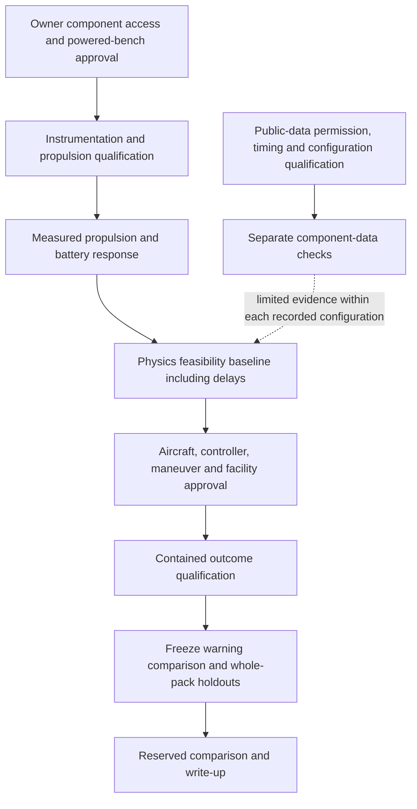

# Roadmap

## Question and finish line

Does a maneuver-specific warning improve on a physics feasibility baseline
based on thrust-to-weight and height to arrest descent, including delays, on
unseen packs, payloads and guard conditions? Compare voltage, sag-history and
load baselines at the same false-alarm burden and report useful warning lead time.

Finish with qualified component measurements, a reproducible physics baseline,
independent outcomes for an approved fixed controller and maneuver, a frozen
warning comparison and a scoped write-up. If the measurements or outcomes cannot
support that comparison, report the failed qualification and narrow the claim.
The [owner decision](docs/decisions/dependency-roadmap.md) adopts these
dependencies and repository cleanup. It does not authorize their physical execution.

## Current step

**Done:** the licensed [QDrone2 development response](docs/qdrone-response.md)
and its [registered protocol](Data/qdrone-response/protocol.json) reproduce
continuous altitude tracking under the source authors' controller. Numerical
outputs live in the [result file](Data/qdrone-response/results.json). Independent
pack identities and recovery-failure labels are unavailable in that recording.

**Current:** component instrumentation and propulsion qualification are the next
prerequisites. Existing ownership, wiring plans, synthetic capture tests and CAD
assets do not establish a calibrated or safely contained stand. Hardware access,
configuration and permission to characterize it remain owner-held inputs.

**Blocked:** new measurements and recovery trials await the approvals below.
No new experiment or public-data campaign is started by this cleanup.

## Dependency order

Public-data checks form an optional independent branch. They cannot replace
component qualification for the chosen propulsion system or independent
maneuver outcomes. An aircraft or propulsion change returns to the affected
qualification steps.

## A. Qualify component instrumentation and propulsion

Status: current prerequisite, blocked on owner inputs and powered-bench approval.

Prerequisites: owner identifies the accessible motor, propeller, ESC, battery,
load cell, acquisition chain and mounting/containment arrangement. Resolve
[M2 and M4](OPEN_QUESTIONS.md#pending-owner-decisions) for this bench scope;
retain G5 purchase approval if anything must be bought.

- A.1 Record configuration, component revisions, ranges and installed load paths.
  Assess stand capacity and resolution with fixture mass, preload and off-axis
  loading. Verify tare, alignment, anchoring and load transfer before release.
- A.2 Qualify force, current, voltage, RPM and temperature channels. Establish
  calibration, uncertainty, drift, synchronization, actual acquisition rates,
  dropouts and excitation bandwidth. Nominal conversion rates are not usable
  measurement bandwidth.
- A.3 Review containment, remote stop, electrical protection, operating limits
  and abort responsibility before energizing. Owning parts establishes neither
  readiness nor cost.
- A.4 Add a separately calibrated torque method only if the selected model
  needs torque. A thrust load cell and INA260 do not measure reaction torque.
  A qualified reaction arm or torque sensor needs its own geometry, calibration,
  cross-load assessment and uncertainty; otherwise leave torque unmeasured.

Completion evidence: reviewed configuration and safe operating envelope,
installed calibration records with independent checks, uncertainty and timing
budgets, and recorded approval to collect the intended component measurements.
The [existing bench assets](docs/bench-acquisition.md) are starting material;
their pending fields and historical thresholds remain separate.

## B. Measure propulsion and battery response

Status: future; depends on A and authorization for the specified acquisition.

- B.1 Measure thrust, current, terminal voltage and RPM across a justified command
  and operating range, preserving raw logs, component IDs, tare and calibration.
  Record transients and any saturation without treating observed RPM as a
  physical maximum. Qualify any torque channel before using its output.
- B.2 Separate loaded and open-circuit/rest measurements. Identify what battery
  response the excitation and bandwidth can resolve; state assumptions behind
  resistance or dynamic-model estimates. Track pack identity and charge history.
- B.3 Measure cell/pack and motor temperature with sensor placement and
  uncertainty recorded. A freezer or chamber setpoint is not component
  temperature. Any thermal conditioning needs a safe, approved procedure.
- B.4 Set the pilot and replication scope from measurement variability and the
  intended claim. Repeated samples from one pack are not independent packs;
  preserve separate development and reserved conditions before outcome exposure.

Completion evidence: reproducible curves and response intervals for the measured
configuration, uncertainties, exclusions and observed limits. Unsupported charge,
temperature or transient ranges remain outside the model. No prototype count or
pilot size is a sample-size justification by itself.

## C. Build the mandatory physics feasibility baseline

Status: future; depends on B and measured mass/configuration for each comparison.

- C.1 Compute thrust-to-weight and height required to arrest descent using
  explicit initial velocity, attitude, available height and detection, command,
  actuation and reorientation delays. Account for mass and thrust effects of
  each payload/guard combination. Reorientation dynamics need justified inertia
  and torque inputs, or a stated restriction to a simpler measured maneuver.
- C.2 Propagate measurement uncertainty and distinguish conservative operational
  margins from optimistic necessary feasibility bounds. Failure even under a
  justified optimistic bound can exclude modeled feasibility; passing a bound
  does not guarantee that a controller recovers. Check limiting cases and an
  independent calculation before using the comparator.
- C.3 Freeze the baseline's assumptions, domain, input availability and handling
  of unresolved cases. Keep the measured configuration separate from each public
  dataset vehicle; do not pool them into a validated plant.

Completion evidence: executable baseline with sourced inputs, independent
calculation checks, uncertainty bounds and explicit delay accounting. This
comparator must exist before any learned-warning comparison. Failure of one
controller alone cannot establish that recovery is physically impossible.

## P. Optional public-data checks

Status: selected QDrone2 descriptive check done; other checks conditional.

Prerequisites: permission for reuse, source identity, command/state semantics,
configuration, timing and an endpoint appropriate to the proposed check.

- Preserve the [NanoBench G1 findings](docs/nanobench-g1.md): collection timing
  and deployed configuration remain unresolved. Its [whole-flight split](Data/nanobench-baseline/split.json)
  stays frozen and final-test files unopened. No G1 pass or G2 evaluation follows
  from this roadmap.
- NeuroBEM remains a candidate pending reuse and timing qualification. Its
  processed grid does not establish native sensor bandwidth; recorded motor
  speeds do not establish maximum available RPM or loss of authority. The
  [author request](docs/idsia-data-request.txt) remains unsent.
- Only after eligibility is established and a separate task authorized, compare
  observables within that dataset's configuration and report exclusions.

Completion evidence for any added check: inspected permission and source record,
qualified observables/timing/configuration, frozen development designation and
reproducible result. Public component checks cannot validate unseen recovery
failure labels.

## D. Approve platform, controller, maneuver and facility

Status: owner-held future gate; depends on C before approving recovery trials.
Access and configuration discussions may precede C without authorizing trials.

Prerequisites: [M2–M4](OPEN_QUESTIONS.md#pending-owner-decisions), including exact
aircraft, access/funding, fixed controller, facility and responsible safety owner.

- D.1 Specify initial descent speed, attitude and rotation; controller and sensing;
  delay; available height; and an independently observable completion rule.
- D.2 Review containment or restraint effects, qualified instrumentation,
  emergency stop and staged abort criteria for the actual setup. Tethers and
  nets alone do not establish a qualified or representative test.
- D.3 Record safety approval and the exact authorized operating envelope. Any
  purchase still requires the owner's G5 configuration/budget/measurement decision.

Completion evidence: approved configuration-specific protocol, facility and
safety responsibility, independent outcome measurement and explicit test scope.
No aircraft is selected or powered work approved by this document.

## E. Qualify contained recovery outcomes

Status: future; depends on D and a separately authorized development pilot.

- E.1 Verify sensing, synchronization, containment effects and completion labels
  before collecting comparative trials. Distinguish observed failure of the fixed
  controller from censored, aborted or inadequately measured outcomes.
- E.2 Use development trials to estimate independent pack/run variability,
  useful excitation and failure coverage, then justify comparison size and
  uncertainty. Preserve pack and condition identity; do not inflate sample size
  with correlated frames or repeated maneuvers.

Completion evidence: reviewed independent labels and traceable development
records demonstrating that both outcome measurement and safety procedures work
within the stated envelope. If outcomes cannot discriminate the question,
stop at qualification or narrow the claim.

## F. Freeze and evaluate the warning comparison

Status: future; depends on C and E, with an approved final evaluation scope.

- F.1 Preregister warning features, processing, baselines, false-alarm burden,
  useful lead time, exclusions and independent resampling unit. Include the
  physics feasibility, voltage, sag-history and load baselines under identical
  information availability.
- F.2 Assign whole packs and payload/guard conditions to development and final
  evaluation before exposure. Learn processing only from development data;
  freeze the fitted model and thresholds before opening reserved outcomes.
- F.3 Evaluate the reserved split once. Report missed failures, false alarms,
  lead time, uncertainty and every exclusion. A noisy restatement of the physics
  comparator is grounds to simplify the warning or narrow its claim.

Completion evidence: committed preregistration and frozen model, auditable split,
reproducible comparison and condition-specific errors. No independent recovery
claim follows from simulations alone.

## G. Write up and stop

Status: future; depends on the completed comparison or a documented stop at an
earlier measurement, access or safety gate.

Completion evidence: one report with question, qualified observations,
reproduction commands, failed cases, baseline comparison when available and the
scope that the evidence supports. Separate controller failure from necessary
physics exclusions and unmeasured possibilities. A negative or qualification-only
result can finish the scoped work; external publication remains an owner decision.

## Cost, safety and publication

Only this dependency-plan adoption and repository cleanup are authorized now.
No purchase, powered test, outreach, paid compute, merge or external publication
is authorized. Owner action: supply the proposed component configuration,
access/funding direction and bench safety responsibility for A; M2–M4 remain
unanswered. The [safety material](Safety/README.md) needs configuration-specific
review before any physical operation.

## Preserved scientific gates

The public-data conditions in P remain binding. Historical simulator and
instrumentation checks protect retained evidence, not new aircraft acceptance.
The [history index](docs/history/README.md) records removed obsolete execution
surfaces and retained reproduction sources. [Engineering data](Engineering%20Data/README.md)
keeps numerical inputs separate by configuration; [current results](Analysis/current-results.md)
holds the result index. ROADMAP.md is the only active plan.
