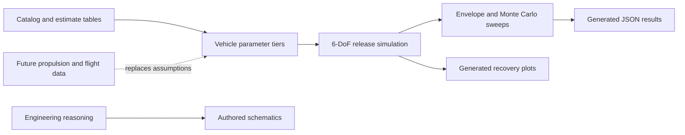

# Data and figure production

This guide distinguishes simulated outputs, deterministic calculations, catalog
inputs, planned measurements, and explanatory diagrams.



## Evidence classes

| Class | Meaning |
| --- | --- |
| Deterministic simulation | Numerical rigid-body and controller integration with one parameter set |
| Monte Carlo simulation | Repeated deterministic simulations with seeded parameter and sensor dispersions |
| Calculation | Mass, guard, budget, and statistical formulas without a dynamic plant simulation |
| Catalog or estimate | Component values and placeholders not measured on the assembled vehicle |
| Authored diagram | Explanatory SVG drawn from the design documents; not a solver output or measurement |
| Physical measurement | No accepted propulsion, guard, or recovery-flight dataset is present yet |

## Recovery time-series and envelope

Generator: [`Analysis/run_release_recovery.py`](../Analysis/run_release_recovery.py)

```bash
python -m Analysis.run_release_recovery
```

The script calls the 6-DoF integration and control logic in
`Analysis/sim_release_recovery.py`. It uses the encoded best, nominal, and worst
parameter tiers, a 60° initial tilt, a 3 m descent budget, and release-detection
plus motor-spool latency. It writes:

- `Data/release_recovery_results.json`;
- `Figures/release_recovery_timeseries.png` and `.pdf`; and
- `Figures/release_recovery_envelope.png` and `.pdf`.

The time-series plot is the nominal tier at 2 rad/s. The envelope scans tumble
rates for each tier and caps recoverable rate at the encoded gyro measurement
range. The inputs are repository-contained, so the plot can be regenerated, but
the parameter values are not measurements of built hardware.

## Monte Carlo results

Generator: [`Analysis/monte_carlo_recovery.py`](../Analysis/monte_carlo_recovery.py)

```bash
python -m Analysis.monte_carlo_recovery
```

The script uses fixed random seeds and uniform dispersions for mass, inertia,
torque, thrust, latencies, battery sag, motor mismatch, sensor noise, and CG
offset. It evaluates placeholder-authority, balance-controlled, and
mixer-authority scenarios and writes `Data/monte_carlo_results.json`.

There is no committed Monte Carlo plot. Tables in
[`Analysis/current-results.md`](../Analysis/current-results.md) are transcribed
from the generated JSON. The mixer-authority scenario still depends on an
assumed 60 mm arm and catalog thrust; the registered measured-authority workflow
must replace those values before the simulation can close the gate.

## Survivable-set study (Study A/B)

Generator: [`Analysis/run_survivable_set.py`](../Analysis/run_survivable_set.py)

```bash
python -m Analysis.run_survivable_set
```

Monte Carlo simulation class. Per (failure class, post-failure state cell,
action): the 6-DoF simulation with per-motor failure allocation
(`Analysis/failure_allocation.py`) for the reallocation and mechanism actions,
and a closed-form drag-descent calculation for the parachute-like action, all
under the gated dispersion draw and exact Clopper–Pearson bounds. Writes
`Data/survivable_set_results.json`, `Figures/survivable_set_psafe.png`, and
`Figures/survivable_set_policy.png`. Action parameters marked EST are owner
inputs (OQ-010); the preregistration in
[`docs/specs/survivable-set/design.md`](specs/survivable-set/design.md) freezes
criteria, cells, seeds, and the mechanism kill criterion.

## Other generated data

| Output | Generator | Main inputs |
| --- | --- | --- |
| Mass rollup | `Analysis/budget.py` | `Engineering Data/mass_budget.csv` |
| Guard functional check | `Analysis/guard.py` | Encoded low-energy beam cases and clearance requirement |
| Classifier confidence bounds | `Analysis/classifier_stats.py` | Trial and event counts |
| Hardware resource checks | `Analysis/hardware_resources.py` | Interface and power CSV tables |
| Measured-authority verdict | `Analysis/measured_authority_gate.py` | Future derived CSV + hashed raw/calibration/uncertainty/derivation manifest, six sampled-motor IDs, unique observations; [format](specs/measured-authority-gate/evidence-contract.md) |
| State-machine Mermaid | `Analysis/render_state_machine.py` | `Controls/state_machine.json` |

Run the repository tests before updating result documents:

```bash
python -m unittest discover -s Analysis/tests -v
```

## Engineering diagrams

`Figures/guard-load-path.svg`, `Figures/recovery-fbd.svg`, and
`Figures/release-rig-safety.svg` are editable SVG schematics. They illustrate
load transfer, forces, and the planned safety layout. They were authored
directly as vector drawings; no analysis script generates them. Their arrows
and geometry are explanatory and should not be read as scaled CAD, FEA, or test
data.

## Future physical data

The expected test directory structure and raw-data policy are in
[`Data/README.md`](../Data/README.md). Physical measurement folders should
contain metadata, unedited instrument exports, logs, external video references,
processed outputs, and notes. The measured-authority CSV contract is frozen in
`docs/specs/measured-authority-gate/`.

See [`figure-manifest.json`](figure-manifest.json) for the machine-readable
figure map.
