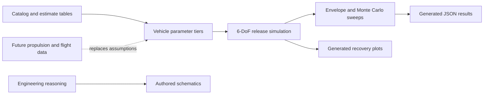

# Data and figure production

## Current QDrone2 component result

[Source and license](../Data/qdrone-response/sources.json),
[registered protocol](../Data/qdrone-response/protocol.json) and
[results](../Data/qdrone-response/results.json) feed the
[response figure](../Figures/qdrone-development-response.png), generated by
[qdrone_response.py](../Analysis/qdrone_response.py). The
[report](qdrone-response.md#reproduce) gives the pinned acquisition and execution
command. Observations belong to the dataset authors; the figure describes
tracking within a development recording, with no recovery-failure labels.

The [roadmap](../ROADMAP.md) holds the dependency order and scientific gates.
Retained historical plots still have their reproduction sources; the obsolete
conceptual overview and unused control renderer were removed, as recorded in
[cleanup and retention](history/README.md#cleanup-and-retention).

## Prior Crazyflie results

Inputs remain in the [platform register](../Engineering%20Data/platform_crazyflie.csv).

| Artifact | Source and scope |
| --- | --- |
| [Development errors](../Data/nanobench-baseline/development-errors.csv) and [run record](../Data/nanobench-baseline/development-run.json) | Documented models and persistence, with per-flight exclusions and errors; [reproduction](nanobench-baseline.md#reproduce) |
| [Replay figure](../Figures/nanobench-baseline.png) | Generated by [plot_nanobench_baseline.py](../Analysis/plot_nanobench_baseline.py) from the development error table; NanoBench observations collected by the dataset authors |
| [Excerpt audit](../Data/nanobench-baseline/excerpt-audit.json) | Independent arithmetic on the previously exposed development excerpt; preserves the observed mismatch |
| [Timing qualification](../Data/nanobench-g1/qualification.json) | Pinned source inspection and excerpt reproduction; [command and interpretation](nanobench-g1.md#reproduce) |

The [split](../Data/nanobench-baseline/split.json) remains frozen. Final-test
predictions are unopened, and G1 remains incomplete. Battery telemetry describes
the recorded configuration; it contains no current channel from which to
establish a general electrical-energy model.

## Historical designed-aircraft outputs

This guide distinguishes simulated outputs, deterministic calculations, catalog
inputs, planned measurements, and explanatory diagrams.


```mermaid
flowchart LR
    CAT[Catalog and estimate tables] --> PARAM[Vehicle parameter tiers]
    PARAM --> SIM[6-DoF release simulation]
    SIM --> SWEEP[Envelope and Monte Carlo sweeps]
    SWEEP --> JSON[Generated JSON results]
    SIM --> PLOTS[Generated recovery plots]
    TEST[Future propulsion and flight data] -. replaces assumptions .-> PARAM
    DESIGN[Engineering reasoning] --> SVG[Authored schematics]
```

## Evidence classes

| Class | Meaning |
| --- | --- |
| Deterministic simulation | Numerical rigid-body and controller integration with one parameter set |
| Monte Carlo simulation | Repeated deterministic simulations with seeded parameter and sensor dispersions |
| Calculation | Mass, guard, budget, and statistical formulas without a dynamic plant simulation |
| Catalog or estimate | Component values and placeholders not measured on the assembled vehicle |
| Authored diagram | Explanatory SVG drawn from the design documents; not a solver output or measurement |
| Physical measurement | No project-collected propulsion, guard or recovery-flight dataset is accepted; the Crazyflie replay above uses attributed third-party ordinary-flight observations |

## Recovery time-series and envelope

Generator: [`Analysis/run_release_recovery.py`](../Analysis/run_release_recovery.py)

```bash
python -m Analysis.run_release_recovery
```

The script calls the 6-DoF integration and control logic in
`Analysis/sim_release_recovery.py`. It uses the encoded best, nominal, and worst
parameter tiers, a 60° initial tilt, a 3 m descent budget, and release-detection
plus motor-spool latency. It writes:

- `Data/release_recovery_results.json`;
- `Figures/release_recovery_timeseries.png` and `.pdf`; and
- `Figures/release_recovery_envelope.png` and `.pdf`.

The time-series plot is the nominal tier at 2 rad/s. The envelope scans tumble
rates for each tier and caps recoverable rate at the encoded gyro measurement
range. The inputs are repository-contained, so the plot can be regenerated, but
the parameter values are not measurements of built hardware.

## Monte Carlo results

Generator: [`Analysis/monte_carlo_recovery.py`](../Analysis/monte_carlo_recovery.py)

```bash
python -m Analysis.monte_carlo_recovery
```

The script uses fixed random seeds and uniform dispersions for mass, inertia,
torque, thrust, latencies, battery sag, motor mismatch, sensor noise, and CG
offset. It evaluates placeholder-authority, balance-controlled, and
mixer-authority scenarios and writes `Data/monte_carlo_results.json`.

There is no committed Monte Carlo plot. Tables in
[`Analysis/current-results.md`](../Analysis/current-results.md) are transcribed
from the generated JSON. The mixer-authority scenario still depends on an
assumed 60 mm arm and catalog thrust; the registered measured-authority workflow
must replace those values before the simulation can close the gate.

## Survivable-set study (Study A/B)

Generator: [`Analysis/run_survivable_set.py`](../Analysis/run_survivable_set.py)

```bash
python -m Analysis.run_survivable_set
```

Monte Carlo simulation class. Per (failure class, post-failure state cell,
action, controller variant): the 6-DoF simulation with per-motor failure
allocation (`Analysis/failure_allocation.py`, cascaded torque-priority) for the
reallocation and mechanism actions, and a closed-form drag-descent calculation
for the parachute-like action, all under the gated dispersion draw and exact
Clopper–Pearson bounds. Variant `a` is the baseline PD controller; variant `a2`
adds gyroscopic feedforward and EST yaw rotational drag. Writes
`Data/survivable_set_results.json`, `Data/survivable_set_results_a2.json`, and
`Figures/survivable_set_{psafe,policy}{,_a2}.png`. Two diagnostics:
`--convergence` writes `Data/survivable_set_convergence.json` (dt-halving
impact-state deltas) and `--smoke` exercises the pipeline in CI without writing.
Action parameters marked EST are owner inputs (OQ-010); the preregistrations in
[`docs/specs/survivable-set/design.md`](specs/survivable-set/design.md) and
[`design-a2.md`](specs/survivable-set/design-a2.md) freeze criteria, cells,
seeds, machinery revisions, and the mechanism kill criterion. The drop-test
prediction registered before any hardware drop lives in
[`drop-test-prediction.md`](specs/survivable-set/drop-test-prediction.md). Scope limits and the status of the 2026-09-24 external critique are in [`critique-2026-09-24-status.md`](specs/survivable-set/critique-2026-09-24-status.md) — note that the `policy` field ranks **design packages**, not in-flight actions.

## Bench acquisition (V995 demonstrator, retired 2026-10-04)

Wiring and settings: [`docs/bench-acquisition.md`](bench-acquisition.md). Firmware
([`Instrumentation/firmware/code.py`](../Instrumentation/firmware/code.py)) and the
host-side demuxer (`python -m Instrumentation.bench_capture --port ... --out ...`)
write raw captures under `evidence/week-<date>/runs/<run_id>/` (one CSV per sensor +
one manifest) with calibrations under `calibrations/<id>/`; no run against real
hardware exists yet, and a device reset mid-run marks the manifest incomplete rather
than splicing it. This chain measures the stock V995, a different platform from the
designed vehicle above — see
[`evidence/week-2026-09-19/platform-capabilities.md`](../evidence/week-2026-09-19/platform-capabilities.md).

## Other generated data

| Output | Generator | Main inputs |
| --- | --- | --- |
| Mass rollup | `Analysis/budget.py` | `Engineering Data/mass_budget.csv` |
| Guard functional check | `Analysis/guard.py` | Encoded low-energy beam cases and clearance requirement |
| Classifier confidence bounds | `Analysis/classifier_stats.py` | Trial and event counts |
| Hardware resource checks | `Analysis/hardware_resources.py` | Interface and power CSV tables |
| Measured-authority verdict | `Analysis/measured_authority_gate.py` | Future derived CSV + hashed raw/calibration/uncertainty/derivation manifest, six sampled-motor IDs, unique observations; [format](specs/measured-authority-gate/evidence-contract.md) |
| Historical control specification | Renderer retired; [pre-cleanup source](https://github.com/500ft/multirotor-recovery-dynamics/blob/6b5f45e0bb39ffdeeef004dbebd51f8e4d1e7a1b/Analysis/render_state_machine.py) | `Controls/state_machine.json` retained for the frozen drop protocol |

Run the repository tests before updating result documents:

```bash
python -m unittest discover -s Analysis/tests -v
```

## Engineering diagrams

`Figures/guard-load-path.svg`, `Figures/recovery-fbd.svg`, and
`Figures/release-rig-safety.svg` are editable SVG schematics. They illustrate
load transfer, forces, and the planned safety layout. They were authored
directly as vector drawings; no analysis script generates them. Their arrows
and geometry are explanatory and should not be read as scaled CAD, FEA, or test
data.

## Future physical data

The expected test directory structure and raw-data policy are in
[`Data/README.md`](../Data/README.md). Physical measurement folders should
contain metadata, unedited instrument exports, logs, external video references,
processed outputs, and notes. The measured-authority CSV contract is frozen in
`docs/specs/measured-authority-gate/`.

See [`figure-manifest.json`](figure-manifest.json) for the historical
designed-aircraft figure map; the Crazyflie result sources are listed above.
